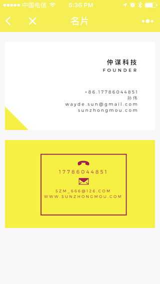
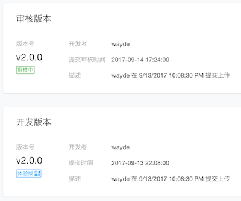

# 0成本发布《仲谋科技》微信官方小程序 - 仲谋科技 孙•仲谋™

> 实际运行截图如下

 

 

 

 

## 如何运行源码

* 需要下载微信官方小程序模拟器。[下载地址](https://mp.weixin.qq.com/debug/wxadoc/dev/devtools/download.html)
* 下载源码，用官方工具创建空AppID项目，可本地查看
* 配置后台
    1. 注册[知晓云](https://cloud.minapp.com/)账号
    2. 在知晓云创建应用并授权小程序
    3. 按知晓云配置说明在[腾讯公众平台](https://mp.weixin.qq.com)设置后台: `设置 -》开发设置 -》服务器域名`
    3. 在知晓云应用中分别添加数据表star, events表，并添加自定义字段如下所示(注：创建表时会默认生成一些系统自用字段，不用理会):
        * star: ***[nick_name, mobile_phone, description]<string>*** 
        
        * events: ***[type, content, mobile_phone, avatar_url, username, title, last_reply_at]<string>***
        
    4. 打开小程序定制配置文件 `/etc/config.js` , 进行自定义:
    
    

## 当前状态：目前已经提交，正在审核中

 
 

# 合作

如果你也想拥有自己的小程序，欢迎联系我们。

